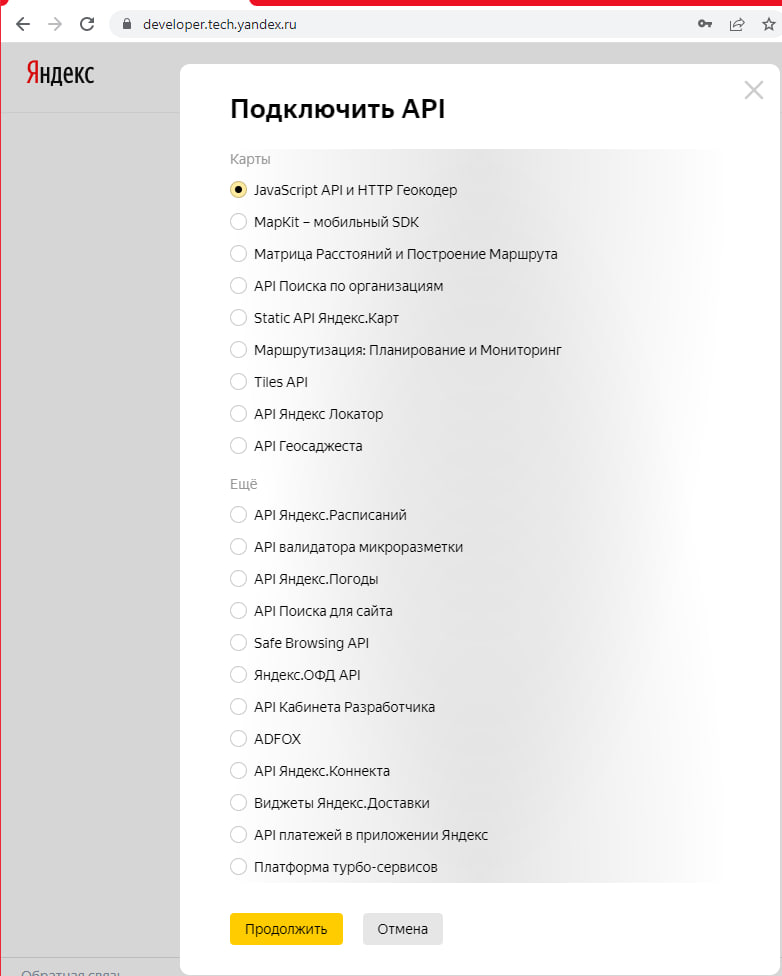
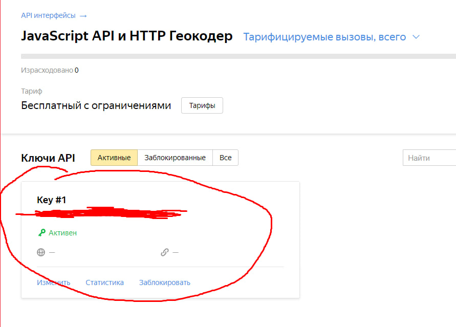

##

## Для редактирования настроек меняйте .env файл

Установка
------

```
git clone https://github.com/BenitoSwaggolini/Avito-favorite-products-on-map.git
python -m venv venv
.\venv\Scripts\activate
pip install -r requirements.txt
```

Для успешной работы с приложением следует выполнить следующие действия:
------

1) Укажите в файле .env в поле BROWSER ваш основной браузер(список доступных:Chrome, Firefox, Opera, Opera GX, Edge,
   Chromium, Brave, Vivaldi, and Safari).
2) Авторизуйтесь на сайте авито,используя указанный в .env браузер
3) Получите API ключ 'JavaScript API и HTTP Геокодер' на странице: https://developer.tech.yandex.ru/services/
   
   
4) Поставьте полученный ключ в поле API_KEY .env файла и подождите 15 минут(Ключ активируется через некоторое время)
5) Запустите скрипт, используя следующую команду: ```python main.py```, находясь в директории проекта
6) Перейдите на http://127.0.0.1:8000/ (в первый раз загрузка маркеров будет происходить больше обычного)
7) Пользуйтесь приложением!